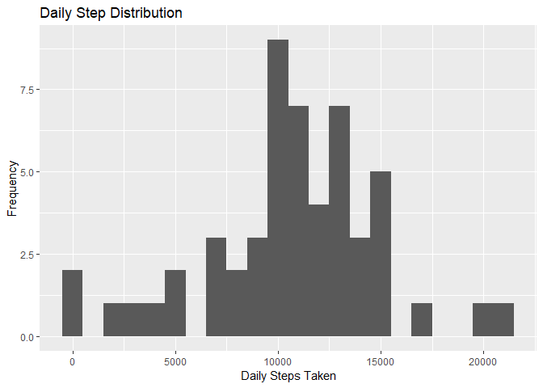
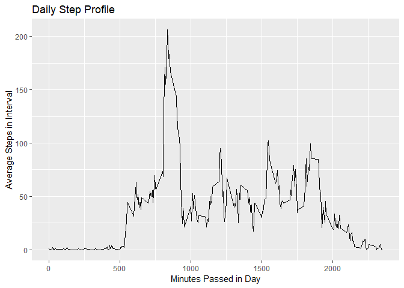
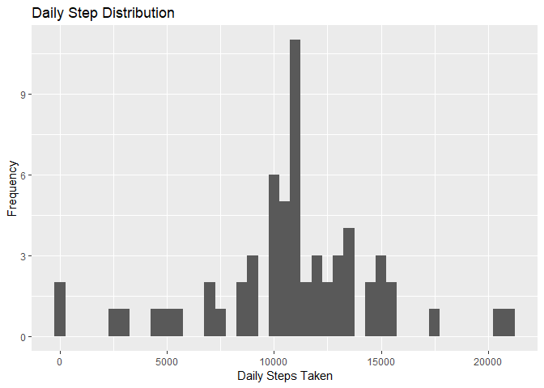
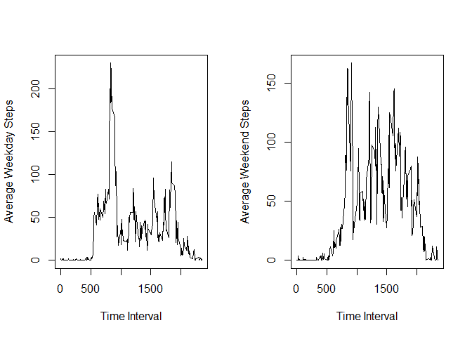

## Activity Monitoring Analysis - Steps  

This analysis entails examining a steps dataset. The data set has 17568 observations.Each observation is the number of steps taken in a 5 minute interval. Data is collected for 2 months.

We break up the analysis and look at the following components as shown in each of the following sections. First we start with loading appropriate libraries and reading in data.


```r
#libraries
suppressPackageStartupMessages(library(tidyverse))
suppressPackageStartupMessages(library(ggplot2))
#data injestion
 setwd("~/Data Science/Johns Hopkins DS Specialization/05_ReproducibleResearch/week 2 project")
 steps = read.csv("activity.csv") 
```

## Daily Activity - Histogram, Mean, and Median

We have to create the right data frame to get daily aggregation. Then we can produce a histogram plot showing a distribution of daily steps taken over the two month span:


```r
# create dataframe for daily totlals
daily.steps = steps %>% group_by(date) %>% 
              summarise(day.steps = sum(steps,na=TRUE))
# histogram
hist.1 = ggplot(data = filter(daily.steps,!is.na(day.steps)))+geom_histogram(aes(x=day.steps), binwidth = 1000)
hist.1 = hist.1 + labs(x="Daily Steps Taken",y="Frequency",title="Daily Step Distribution")
hist.1
```

<!-- -->

Since there are only 61 days the distritbution will showing some missing bins. However at first glance, the distribution seems to be somewhat normal. Let's look at the mean and median steps taken in a day:


```r
mean.steps = mean(daily.steps$day.steps, na=TRUE)
med.steps = median(daily.steps$day.steps, na=TRUE)
print(paste("Mean number of daily steps ",round(mean.steps,2)))
```

```
## [1] "Mean number of daily steps  10767.19"
```

```r
print(paste("Median number of daily steps ",round(med.steps,2)))
```

```
## [1] "Median number of daily steps  10766"
```

## Daily Steps Profile

We now look at what an average day looks like in terms of number of steps taken by time interval. Remember that data is collected each 5 minute interval. First we aggregagte the data and then we can create the profile plot


```r
avg.steps = steps %>% group_by(interval) %>% 
             summarise(avg.steps=mean(steps,na=TRUE))

avg.steps.plot = ggplot(avg.steps)+geom_line(aes(x=interval,y=avg.steps))
avg.steps.plot = avg.steps.plot+labs(x="Minutes Passed in Day",y="Average Steps in Interval",
                                     title="Daily Step Profile")
avg.steps.plot
```

<!-- -->

Looking at the plot, we can begin to interpret, that this is slow period at the begining and end of the plot - probably when the subect is sleeping. Then we see that in the morning there is a spike, and then ebbs and flows through out the day.

Next lets take a look at the maximum interval and when it takes place


```r
max.avg.steps = max(avg.steps$avg.steps)
max.time.int =filter(avg.steps,avg.steps==max.avg.steps) %>% pull(interval)
print(paste("Max Average Steps taken in Day ",round(max.avg.steps,2)))
```

```
## [1] "Max Average Steps taken in Day  206.17"
```

```r
print(paste("Time Interval with Max avg steps Taken ",round(max.time.int,2)))
```

```
## [1] "Time Interval with Max avg steps Taken  835"
```

## Missing Values - Imputing and rexamine data
We will start by identifying the missing steps data. Then come up with a strategy for imputing missing observations.


```r
missing.count = nrow(filter(steps,is.na(steps)))
missing.count
```

```
## [1] 2304
```

For imputing the missing data, we will use the daily average profile dataset we created, and based of the time interval of missing data, essentially look up what the time interval's average should. We'll accomplish this by using a join with the folling conditions - Time interval, and observation must be na:


```r
impute.df =left_join(steps,avg.steps,by=c("interval"="interval"),"steps"="NA") 
impute.df$steps[is.na(impute.df$steps)] = impute.df$avg.steps[is.na(impute.df$steps)]
```

Let's examine again, now with the full (imputed) dataset. We will be taking the same steps earlier - create daily average, create a histrogram, and look at the mean and median steps in a day:


```r
daily.steps.2 = impute.df %>% group_by(date) %>% 
  summarise(day.steps = sum(steps,na=TRUE))
# histogram
hist.2 = ggplot(data = daily.steps.2)+geom_histogram(aes(x=day.steps),binwidth = 500)
hist.2 = hist.2 + labs(x="Daily Steps Taken",y="Frequency",title="Daily Step Distribution")
hist.2
```

<!-- -->

Looking at new mean and median 


```r
mean.steps.2 = mean(daily.steps.2$day.steps, na=TRUE)
med.steps.2 = median(daily.steps.2$day.steps, na=TRUE)
print(paste("Mean number of daily steps ",round(mean.steps.2,2)))
```

```
## [1] "Mean number of daily steps  10767.19"
```

```r
print(paste("Median number of daily steps ",round(med.steps.2,2)))
```

```
## [1] "Median number of daily steps  10767.19"
```

As we might expect, none of the descriptive statistics change. This is because simple applied average steps based on interval segment to missing intervals. 

## Weekday Analysis

Below we break up weekend and weekday activity to see if we observer differences.

The first step is to create a new factor variable to identify, based off of a date, if an observation is on a weekday or weekend. 


```r
impute.df$weekday = weekdays(as.Date(impute.df$date))
impute.df$weekend.flag = ifelse(impute.df$weekday=="Saturday"|
                                impute.df$weekday=="Sunday","Weekend","Weekday")
# create weekday vs. weekend avg daily profile
avg.wd.steps = impute.df %>% filter(weekend.flag=="Weekday") %>% 
                group_by(interval) %>% 
                summarise(avg.steps=mean(steps,na=TRUE))
avg.we.steps = impute.df %>% filter(weekend.flag=="Weekend") %>% 
                group_by(interval) %>% 
                summarise(avg.steps=mean(steps,na=TRUE))
names(avg.wd.steps)[2] = "avg.wd.steps"
names(avg.we.steps)[2] = "avg.we.steps"
```

The code above creates a new weekday variable, then a seperate flag variable to idenifty weekday vs. weekend. Next we aggregate two seperate dataframes - one for weekday and one for weekend, so we can get two diffent profiles.

Below we simply join into 1 data frame based off of time interval. This will be the dataframe used for plotting. 


```r
weekday.avg = inner_join(avg.wd.steps,avg.we.steps,by=c("interval"="interval"))
```

Creating plot below


```r
par(mfrow=c(1,2))
with(weekday.avg,
     plot(weekday.avg$interval,weekday.avg$avg.wd.steps,type = "l",
     xlab = "Time Interval",ylab = "Average Weekday Steps"))
with(weekday.avg,
     plot(weekday.avg$interval,weekday.avg$avg.we.steps,type = "l",
          xlab = "Time Interval",ylab = "Average Weekend Steps"))
```

<!-- -->

From the plot above we can gather a few interesting observations.

* During the weekday, the subject wakes up and immediately goes into a high level of activity. This occurs around 500 time interval. During the weekend the subject seems to start much slower.
* During the weekday, after the initial spike, there are ebbs and flows but the overall level of activity is pretty low. In contrast, the weekend shows much higher and sustained activity.
